# TRES CUATRO CINCO STEAKHOUSE

TRES CUATRO CINCO STEAKHOUSE in Bogota, Colombia, is a charming family-owned restaurant specializing in imported American Angus Beef. We take pride in using ingredients from local small producers, ensuring a delightful dining experience that´s as fresh as it is flavorful.

This website serves as a digital gateway, purposefully designed to elevate our restaurant's online presence. Here, we invite you to explore not only our delectable gastronomic offerings but also to discover our versatility in hosting a diverse range of corporate events.

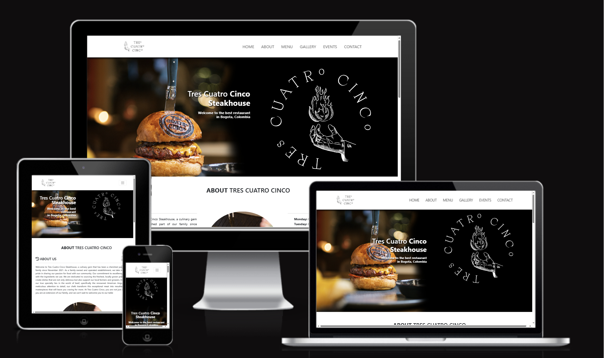

The TRES CUATRO CINCO STEAKHOUSE website, can be found here, followingthis link [here](https://juanjosecurreal.github.io/tres-cuatro-cinco/).

## Table of Content

+ [UX](#ux)
+ [Design](#design)
+ [Features](#features)
+ [Testing](#testing)
+ [Technologies Used](#technologies_used)
+ [Deployment](#deployment)
+ [Credits](#credits)

## UX

### Site Purpose and goal

The website was designed designed with a clear purpose: to provide prospective clients with comprehensive information about our restaurant. Here, you can explore our enticing gastronomical offerings and, if corporate events are of your interest, easily submit your contact information for personalized assistance.

### Audience

Our website caters to two audiences: beef enthusiasts seeking exquisite cuts and businesses in search of the ideal venue for meetings and events.

### Current User Goals

Keeping up to date with new information posted on the website.

### New User Goals

+ Ability to get a general understanding of the restaurant food and drink offerings
+ Contact the restaurant by filling out the form and explaining your desired type of event
+ Visit the company's social media

## Design

### Color Scheme

Our choice of a black and white color scheme isn't just about simplicity; it's a deliberate alignment with our brand's aesthetics. While it may seem easy, this classic combination is remarkably effective in enhancing user experience. The timeless elegance of black and white underscores our commitment to providing a seamless and visually appealing journey on our website.

### Typography

the font was not changed for this project.

### Imagery

All the images used for the website are images taken directly in the restaurant. No images were used from an outside source.

## Features

### Exisiting features

#### Navigation bar

 the navigation bar ensures effortless browsing. The choice of fonts and colors provide good readability and visual comfort. On larger screens, our navigation bar boasts the restaurant's logo on the left, exuding our brand identity, while neatly organized links to various sections of the page reside on the right, granting direct access to your desired content. 

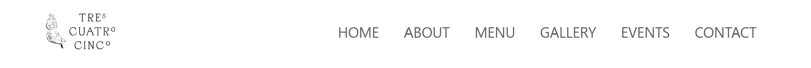

For smaller screens, i have maintained this user-friendly approach by placing the logo on the left, accompanied by a sleek hamburger menu on the left.

#### Home section

On the homepage, I decided to keep it simple and created a banner. This banner displays a picture of one of our famous dishes, which is the hamburger. On the right side, you'll find the restaurant's logo. At the top of the image, there is a subtitle with the name of the restaurant and a brief explanation.

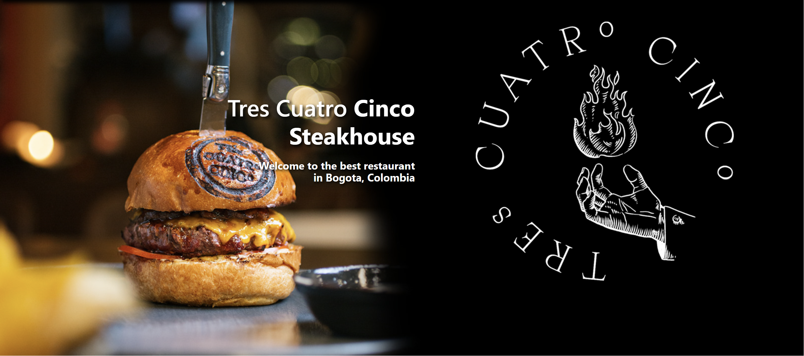

#### About Us section

This page offers users a glimpse into the essence of TRES CUATRO CINCO. It begins with a "HISTORY" section, delving into the restaurant's origins and our gastronomic philosophy, providing a comprehensive understanding of our journey and culinary approach.

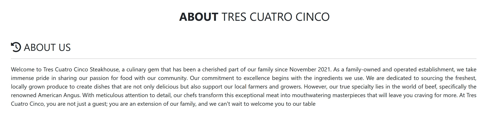

Right Below the "HISTORY" section, you will encounter a circular image of the restaurant´s main salon. In my opinion it gives style to the site. By mixing pictures and text we are giving a better user experience.

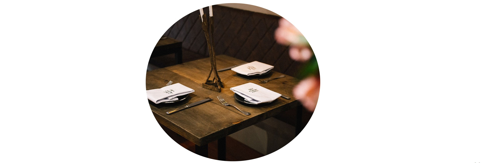

The "About Us" section also includes a dedicated working hours section. It is imperative for users visiting the webpage to know when they can enjoy lunch or dinner. This information is clearly presented in a list right below the salon image.

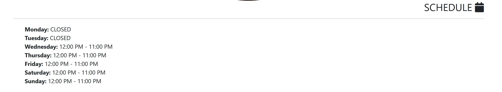

#### Menu Section

This section primarily serves to offer users the option of checking our menu online. It features two pictures—one showcasing our selection of drinks, and the other highlighting a delectable piece of beef. Within each picture, you'll find a button that directs you to the respective menu, where you can explore our diverse range of offerings.

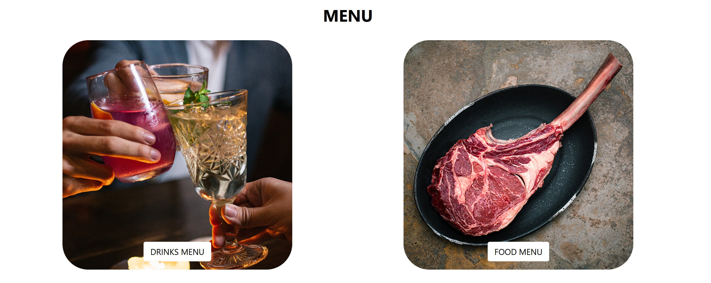

#### Events Section

This section has been exclusively designed for clients interested in hosting events at the restaurant. On the left side of this section, you'll find a form where clients are requested to provide the following information:

+ First Name
+ Last Name
+ Email
+ Phone Number
+ Event Type

This information enables the restaurant to reach out and facilitate various types of business bookings. On the right side of the section, you'll also find an additional restaurant logo, adding an elegant touch to this part of the website.

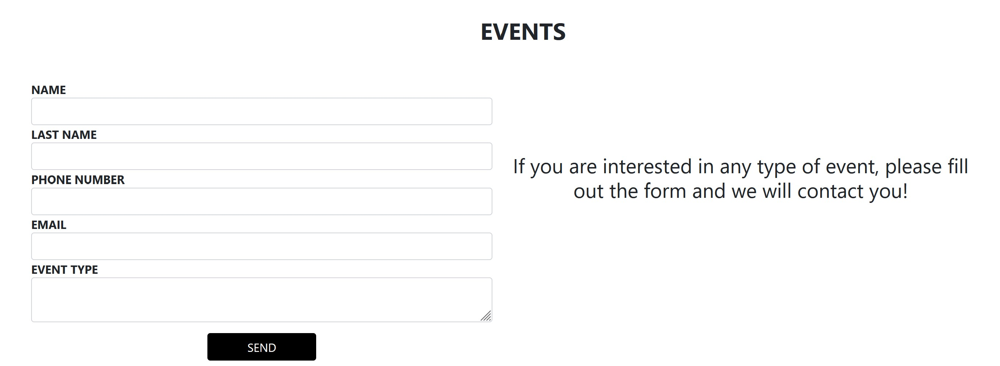

#### Contact us section

On the contact us section, you will find important information about the restaurant.

+ Email
+ phone number
+ address

Moreover, in order for the section to be more elegant, I included another logo of the restaurant.

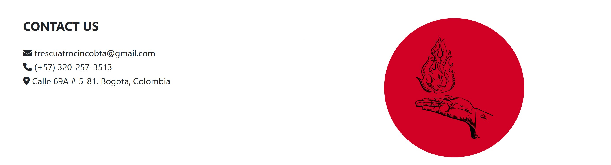

#### Footer section

In the footer section, I've aimed to provide clients with crucial information. Firstly, you'll discover the restaurant's location on Google Maps, making it easier for people to locate TRES CUATRO CINCO. Additionally, there are links to all of our social media platforms, where you can explore various types of content.

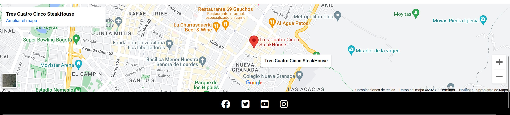

### Future features

As previously mentioned in this document, this project represents a prototype website for an actual restaurant based in Colombia. As a result, there are a few implementations that can be made in order for the site to be more user friendly

+ Enhancements to the dropdown navigation menu to align with best practices and improve user experience.
+ include in the gallery section videos that show the process of food preparation.
+ Create an actual data base where I can interact with clients to grow business events.

## Testing

The most challenging aspect of this assignment, for me, was determining the positioning of elements. Typically, I use flexbox for such tasks, but in this project, I discovered the benefits of Bootstrap. Bootstrap enabled me to achieve superior element positioning on the webpage, particularly through the use of classes like 'container,' 'row,' and 'col-sm-#.' These classes significantly improved the page layout. While testing for proper positioning was initially difficult, I eventually succeeded

Regarding browser compatibility, the webpage functions seamlessly on Edge, Mozilla, and Chrome. Furthermore, I used dev tools to ensure the webpage's responsiveness on desktops, cellphones, and tablets. In addition, the form in the events area is fully functional, requiring correct input for each field. Lastly, the navbar effectively navigates users to their intended sections of the page.

### Validatior testing

+ the Index and Gallery, passed through the W3C validator
  
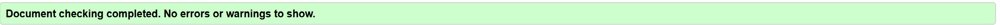 

+ No errors on the CSS validator (gigsaw)

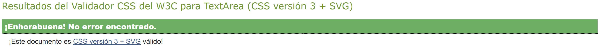

+ Lighthouse check 

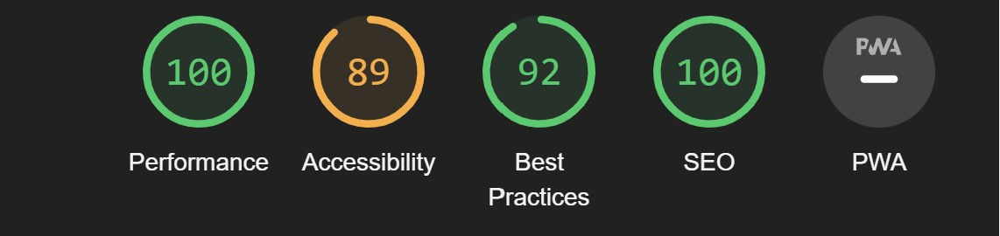

### Unfixed bugs

I did not find any bugs during the testing.

## Technologies used

### Programming langauges used

- HTML5
+ CSS
+ JavaScript

### Frameworks, Libraries & Programs used

- Google Fonts - for the font families: Roboto and Lato. San-serif was used as a default font.
+ Font Awesome - to add icons for the home services section, about us values section and the social media links in the footer.
+ GitPod/CodeAnywhere - to creat my html files & styling sheet before pushing the project to Github.
+ GitHub - to store my repository for submission.
+ Am I Responsive? - to ensure the project looked good across all devices.
+ bootstrap

### Deployment

The site was deployed to GitHub pages. The steps to deploy are as follows:

+ In the GitHub repository, navigate to the Settings tab
+ On the left hand side menu, navigate to the pages tab user code and automation.
+ In build and deplyment, under branch, select the main Branch
+ Once the main branch has been selected, the page will be automatically refreshed with a detailed ribbon display to indicate the successful deployment.
+ The live link can be found [here - Infrastructura y Senalizacion](https://juanovt10.github.io/seprocivilCO/).

## Credits

### Design

The company provided all the information regarding the content information. The design was inspired by various type of engineering websites of multinational companies, including:

+ [Arup](https://www.arup.com/)
+ [AECOM](https://aecom.com/)
+ [eyrise B.V.](https://www.eyrise.com/)
+ [Henstaff Construction](https://www.henstaff.co.uk/)

### Code

From the very beginning, my mentor Martina Terlevic advised me to utilize flexbox for element positioning. However, as I encountered challenges in this area, I sought further guidance. I found the [flexfrog tutorial](https://flexboxfroggy.com/) and [flexbox guide](https://css-tricks.com/snippets/css/a-guide-to-flexbox/), which proved invaluable in helping me understand the workings of flexbox, its various applications, and any limitations it may have. These resources provided me with the necessary knowledge and skills to overcome my struggles and effectively utilize flexbox for optimal element positioning.

The standout feature of the project is the implementation of the "hamburger" menu. This menu type is well-suited for smaller devices due to best practices and a large navigation bar. To accomplish this, I referred to the full stack development lessons on [Code Institude](https://codeinstitute.net/global/) to grasp the principles of variables in JavaScript and learn how to transform HTML ids and classes into JavaScript variables. The resources utilized for this purpose were:

+ [W3C schools](https://www.w3schools.com/jsref/met_document_queryselector.asp)
+ [Tahmid Ahmed youtube tutorial](https://www.youtube.com/watch?v=VRrEquQfh88)

Furthermore, I drew inspiration for form styling and interaction from the following source:
+ [CodingLab](https://www.youtube.com/watch?v=okbByPWS1Xc)

### Media

The hero image was the only image taken from a free stock page:
+ [Road avenue with adjacent trees from Pixabay](https://pixabay.com/photos/asphalt-street-trees-avenue-2178703/)

The rest of the picture where provided directly from the existing company in Colombia. The contact details are the follwoing:
+ Eduardo Velasquez
+ eaduardoantoniovelasquezv@gmail.com
